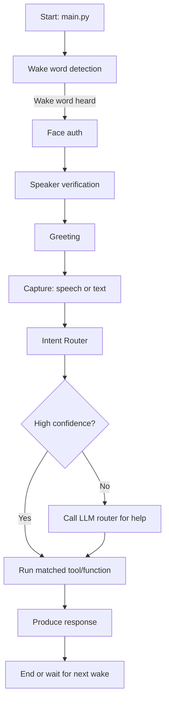

# Friday Assistant — A Kid-Friendly Guide

Welcome! This project is called "Friday" and it's like Tony Stark's helper, Friday - but smaller and made for your own computer.

## Aim

- Trying to mimic and upgrade Iron Man's Friday assistant.
- To build a complete automated AI voice assistant that can do many things: have a chat, run programs, open apps, add items to a cart, help write code, and more.

## What is Friday? (Simple)

- Friday is a program that listens to you, understands what you want, and then does it.
- It can listen for a special wake word (like "Friday!") so it only acts when you ask.
- It can check who you are using your face or your voice.
- It can talk back using the computer's voice.

## Key Parts (Short and sweet)

- `main.py`: The starting point — it turns on Friday and connects everything.
- Wake word detector: Listens for a special word to wake the assistant.
- Face authentication: Checks your face so the assistant knows it's you.
- Speaker verification: Checks your voice to be extra sure it's you.
- Intent router: Decides what you want to do from your sentence.
- Tools / functions: The small programs Friday uses to actually do things (open apps, tell time, run commands).

## How Friday Works — Story Version

1. You say the wake word (e.g., "Friday!").
2. Friday listens and wakes up.
3. It checks who you are (face and voice).
4. It greets you and asks what you want.
5. You say something (speech) or type it (text mode).
6. Friday figures out your intent (what you want) using the Intent Router.
7. If it's sure, it runs the matching tool (like "open Chrome").
8. If it's unsure, it can ask a smarter model (LLM) for help.
9. Friday speaks or types back the result.

## Workflow Flowchart (Mermaid)



## Flow of Execution — Step-by-step (technical but simple)

- `main.py` starts and loads all modules (wake word, auth, speech, intent, tools).
- The wake-word module listens continuously but quietly.
- When the wake word is detected, the pipeline begins:
  - Face recognition: capture camera image and verify against saved faces.
  - Voice/speaker check: record a short sample and compare with saved voice profile.
  - If auth passes (or is skipped with flags), the assistant greets the user.
- The speech module converts your spoken words into text (speech-to-text).
- That text is sent to the `IntentRouter` which uses sentence embeddings (a way to turn sentences into numbers) to find the best matching tool.
- If the match is confident, the linked tool runs. Tools are small functions like `open_app`, `get_time`, `shutdown` (dry-run by default), or `run_script`.
- If confidence is low, an LLM (large language model) can be asked to choose the right tool or ask clarifying questions.
- The tool returns a result. The assistant uses text-to-speech to speak the answer, and logs it to the console.

## Functionalities (What Friday can do today)

- Open/Close applications (e.g., Chrome, Notepad, WhatsApp).
- Can shutdown PC commands (careful: many are dry-run by default).
- Tell the time.
- Use authentication to restrict who can control the computer.
- Can used to send messages in WhatsApp (I am using WhatsApp Beta, but if you are using browser or normal WhatsApp application - then please update the open_whatsapp(), close_whatsapp() and send_whatsapp_msg() code based on your need)

## Quick Start (How to try it)

Open a terminal, go to the project folder, and run:

```bash
cd Friday
python main.py --text-mode
```
- `--text-mode`: lets you type commands instead of speaking.
- `--llm-router`: Use an LLM as a fallback when embedding confidence is low.
- `--no-speech`: Print responses without speaking them aloud.
- `--threshold`: Minimum embedding confidence required to execute a tool.
- `--voice-threshold`: Minimum speaker similarity required for voice verification.


Example commands to try:

- open chrome
- launch my browser please
- open notepad
- what time is it
- shutdown pc (dry-run)
- turn off assistant
- send whatsapp message to myself How are you?

## Optional: LLM Router (When Friday needs help)

If Friday isn't sure what you meant it can ask a smarter cloud model. To enable that:

```bash
set OPENAI_API_KEY=your_key_here
python main.py --text-mode --llm-router
```

(Replace `set` with `export` on macOS/Linux.)

## How to Add New Skills (Simple guide)

1. Create a new function in the `friday/tools` or an appropriate module.
2. Register the function in the Intent Router (so Friday knows the tool exists).
3. Add example phrases (utterances) that map to the new tool so embeddings can match.
4. Test locally in `--text-mode` first.

## Replaceable Parts (for developers)

- Wake word engine: swap for any other listener (e.g., hotword libs).
- Face auth: replace the face model with your own detection method.
- Speaker verification: swap models or remove for simpler setups.
- Intent matching: local embeddings or remote LLM routing.

## Safety and Defaults

- Many commands that can change the system (like shutdown) run as "dry-run" by default to avoid accidents.
- If you add powerful tools, keep them protected behind authentication.

## Conclusion

Friday is a learning project that brings together voice, face, and language tools so your computer can listen, understand, and act. It's made to be easy to extend - you can add new skills and improve it over time. The goal is to build an assistant that can do simple everyday tasks and grow into higher-level actions like ordering items, helping write programs, or automating workflows.

## Credits and Notes

- Embeddings use SentenceTransformers `all-MiniLM-L6-v2` by default.
- Speaker verification uses SpeechBrain ECAPA-TDNN (pretrained models included under `pretrained_models`).
- The project is modular: you can replace parts with production implementations.

---
